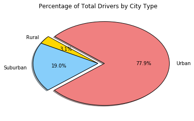

```python
import pandas as pd
import matplotlib.pyplot as plt
import seaborn as sns
```


```python
city_df = pd.read_csv('raw_data/city_data.csv')
ride_df = pd.read_csv('raw_data/ride_data.csv')
```


```python
#duplicates
city_df = city_df.drop_duplicates('city', keep = 'first')
```


```python
#merge
cityride_df = city_df.merge(ride_df, on = 'city')
#cityride_df.head()
```


```python
#group into cities
city_group = cityride_df.groupby('city')

#average fare
avg_fare = city_group.mean()['fare']

#total riders
total_rides = city_group['ride_id'].count()

#total drivers
total_drivers = city_group.mean()['driver_count']

#city type
city_type = city_df.set_index('city')['type']

#city specs
city_specs = pd.DataFrame({
    "Number of Rides": total_rides,
    "Average Fare": avg_fare,
    "Number of Drivers": total_drivers,
    "Type of City": city_type
})

city_specs.sort_values('Number of Drivers', ascending = False)
```


<div>
<style>
    .dataframe thead tr:only-child th {
        text-align: right;
    }

    .dataframe thead th {
        text-align: left;
    }

    .dataframe tbody tr th {
        vertical-align: top;
    }
</style>
<table border="1" class="dataframe">
  <thead>
    <tr style="text-align: right;">
      <th></th>
      <th>Average Fare</th>
      <th>Number of Drivers</th>
      <th>Number of Rides</th>
      <th>Type of City</th>
    </tr>
  </thead>
  <tbody>
    <tr>
      <th>Davidtown</th>
      <td>22.978095</td>
      <td>73.0</td>
      <td>21</td>
      <td>Urban</td>
    </tr>
    <tr>
      <th>South Bryanstad</th>
      <td>24.598571</td>
      <td>73.0</td>
      <td>21</td>
      <td>Urban</td>
    </tr>
    <tr>
      <th>Williamshire</th>
      <td>26.990323</td>
      <td>70.0</td>
      <td>31</td>
      <td>Urban</td>
    </tr>
    <tr>
      <th>West Sydneyhaven</th>
      <td>22.368333</td>
      <td>70.0</td>
      <td>18</td>
      <td>Urban</td>
    </tr>
    <tr>
      <th>Torresshire</th>
      <td>24.207308</td>
      <td>70.0</td>
      <td>26</td>
      <td>Urban</td>
    </tr>
    <tr>
      <th>Fosterside</th>
      <td>23.034583</td>
      <td>69.0</td>
      <td>24</td>
      <td>Urban</td>
    </tr>
    <tr>
      <th>Spencertown</th>
      <td>23.681154</td>
      <td>68.0</td>
      <td>26</td>
      <td>Urban</td>
    </tr>
    <tr>
      <th>Alyssaberg</th>
      <td>20.609615</td>
      <td>67.0</td>
      <td>26</td>
      <td>Urban</td>
    </tr>
    <tr>
      <th>Smithhaven</th>
      <td>22.788889</td>
      <td>67.0</td>
      <td>27</td>
      <td>Urban</td>
    </tr>
    <tr>
      <th>Lisaville</th>
      <td>28.428929</td>
      <td>66.0</td>
      <td>28</td>
      <td>Urban</td>
    </tr>
    <tr>
      <th>Lake Jennaton</th>
      <td>25.349600</td>
      <td>65.0</td>
      <td>25</td>
      <td>Urban</td>
    </tr>
    <tr>
      <th>West Jefferyfurt</th>
      <td>21.072857</td>
      <td>65.0</td>
      <td>21</td>
      <td>Urban</td>
    </tr>
    <tr>
      <th>Swansonbury</th>
      <td>27.464706</td>
      <td>64.0</td>
      <td>34</td>
      <td>Urban</td>
    </tr>
    <tr>
      <th>Lake Stevenbury</th>
      <td>24.657619</td>
      <td>63.0</td>
      <td>21</td>
      <td>Urban</td>
    </tr>
    <tr>
      <th>Kelseyland</th>
      <td>21.806429</td>
      <td>63.0</td>
      <td>28</td>
      <td>Urban</td>
    </tr>
    <tr>
      <th>West Peter</th>
      <td>24.875484</td>
      <td>61.0</td>
      <td>31</td>
      <td>Urban</td>
    </tr>
    <tr>
      <th>New Aaron</th>
      <td>26.861818</td>
      <td>60.0</td>
      <td>22</td>
      <td>Urban</td>
    </tr>
    <tr>
      <th>New Jeffrey</th>
      <td>24.130000</td>
      <td>58.0</td>
      <td>25</td>
      <td>Urban</td>
    </tr>
    <tr>
      <th>Carrollfort</th>
      <td>25.395517</td>
      <td>55.0</td>
      <td>29</td>
      <td>Urban</td>
    </tr>
    <tr>
      <th>Port Samantha</th>
      <td>27.047407</td>
      <td>55.0</td>
      <td>27</td>
      <td>Urban</td>
    </tr>
    <tr>
      <th>Wiseborough</th>
      <td>22.676842</td>
      <td>55.0</td>
      <td>19</td>
      <td>Urban</td>
    </tr>
    <tr>
      <th>Jacobfort</th>
      <td>24.779355</td>
      <td>52.0</td>
      <td>31</td>
      <td>Urban</td>
    </tr>
    <tr>
      <th>Rodriguezburgh</th>
      <td>21.332609</td>
      <td>52.0</td>
      <td>23</td>
      <td>Urban</td>
    </tr>
    <tr>
      <th>Kellershire</th>
      <td>24.169474</td>
      <td>51.0</td>
      <td>19</td>
      <td>Urban</td>
    </tr>
    <tr>
      <th>Aprilchester</th>
      <td>21.981579</td>
      <td>49.0</td>
      <td>19</td>
      <td>Urban</td>
    </tr>
    <tr>
      <th>Stewartview</th>
      <td>21.614000</td>
      <td>49.0</td>
      <td>30</td>
      <td>Urban</td>
    </tr>
    <tr>
      <th>West Alexis</th>
      <td>19.523000</td>
      <td>47.0</td>
      <td>20</td>
      <td>Urban</td>
    </tr>
    <tr>
      <th>Lisatown</th>
      <td>22.225217</td>
      <td>47.0</td>
      <td>23</td>
      <td>Urban</td>
    </tr>
    <tr>
      <th>Sarabury</th>
      <td>23.490000</td>
      <td>46.0</td>
      <td>27</td>
      <td>Urban</td>
    </tr>
    <tr>
      <th>Zimmermanmouth</th>
      <td>28.301667</td>
      <td>45.0</td>
      <td>24</td>
      <td>Urban</td>
    </tr>
    <tr>
      <th>...</th>
      <td>...</td>
      <td>...</td>
      <td>...</td>
      <td>...</td>
    </tr>
    <tr>
      <th>South Shannonborough</th>
      <td>26.516667</td>
      <td>9.0</td>
      <td>15</td>
      <td>Suburban</td>
    </tr>
    <tr>
      <th>New Brandonborough</th>
      <td>31.902857</td>
      <td>9.0</td>
      <td>14</td>
      <td>Suburban</td>
    </tr>
    <tr>
      <th>Shelbyhaven</th>
      <td>34.828333</td>
      <td>9.0</td>
      <td>6</td>
      <td>Rural</td>
    </tr>
    <tr>
      <th>East Leslie</th>
      <td>33.660909</td>
      <td>9.0</td>
      <td>11</td>
      <td>Rural</td>
    </tr>
    <tr>
      <th>Jeffreyton</th>
      <td>33.165556</td>
      <td>8.0</td>
      <td>18</td>
      <td>Suburban</td>
    </tr>
    <tr>
      <th>Nguyenbury</th>
      <td>25.899615</td>
      <td>8.0</td>
      <td>26</td>
      <td>Urban</td>
    </tr>
    <tr>
      <th>Horneland</th>
      <td>21.482500</td>
      <td>8.0</td>
      <td>4</td>
      <td>Rural</td>
    </tr>
    <tr>
      <th>Lake Sarashire</th>
      <td>26.610000</td>
      <td>8.0</td>
      <td>22</td>
      <td>Urban</td>
    </tr>
    <tr>
      <th>Manuelchester</th>
      <td>49.620000</td>
      <td>7.0</td>
      <td>1</td>
      <td>Rural</td>
    </tr>
    <tr>
      <th>Floresberg</th>
      <td>32.310000</td>
      <td>7.0</td>
      <td>10</td>
      <td>Suburban</td>
    </tr>
    <tr>
      <th>Yolandafurt</th>
      <td>27.205500</td>
      <td>7.0</td>
      <td>20</td>
      <td>Urban</td>
    </tr>
    <tr>
      <th>East Stephen</th>
      <td>39.053000</td>
      <td>6.0</td>
      <td>10</td>
      <td>Rural</td>
    </tr>
    <tr>
      <th>Stevensport</th>
      <td>31.948000</td>
      <td>6.0</td>
      <td>5</td>
      <td>Rural</td>
    </tr>
    <tr>
      <th>Jacksonfort</th>
      <td>32.006667</td>
      <td>6.0</td>
      <td>6</td>
      <td>Rural</td>
    </tr>
    <tr>
      <th>New Johnbury</th>
      <td>35.042500</td>
      <td>6.0</td>
      <td>4</td>
      <td>Rural</td>
    </tr>
    <tr>
      <th>South Jennifer</th>
      <td>29.798750</td>
      <td>6.0</td>
      <td>16</td>
      <td>Suburban</td>
    </tr>
    <tr>
      <th>West Paulport</th>
      <td>33.278235</td>
      <td>5.0</td>
      <td>17</td>
      <td>Suburban</td>
    </tr>
    <tr>
      <th>Martinmouth</th>
      <td>30.498889</td>
      <td>5.0</td>
      <td>9</td>
      <td>Suburban</td>
    </tr>
    <tr>
      <th>West Kevintown</th>
      <td>21.528571</td>
      <td>5.0</td>
      <td>7</td>
      <td>Rural</td>
    </tr>
    <tr>
      <th>Carrollbury</th>
      <td>36.606000</td>
      <td>4.0</td>
      <td>10</td>
      <td>Suburban</td>
    </tr>
    <tr>
      <th>West Evan</th>
      <td>27.013333</td>
      <td>4.0</td>
      <td>12</td>
      <td>Suburban</td>
    </tr>
    <tr>
      <th>South Josephville</th>
      <td>26.823750</td>
      <td>4.0</td>
      <td>24</td>
      <td>Urban</td>
    </tr>
    <tr>
      <th>Matthewside</th>
      <td>43.532500</td>
      <td>4.0</td>
      <td>4</td>
      <td>Rural</td>
    </tr>
    <tr>
      <th>Kinghaven</th>
      <td>34.980000</td>
      <td>3.0</td>
      <td>6</td>
      <td>Rural</td>
    </tr>
    <tr>
      <th>Kennethburgh</th>
      <td>36.928000</td>
      <td>3.0</td>
      <td>10</td>
      <td>Rural</td>
    </tr>
    <tr>
      <th>East Troybury</th>
      <td>33.244286</td>
      <td>3.0</td>
      <td>7</td>
      <td>Rural</td>
    </tr>
    <tr>
      <th>South Elizabethmouth</th>
      <td>28.698000</td>
      <td>3.0</td>
      <td>5</td>
      <td>Rural</td>
    </tr>
    <tr>
      <th>Erikport</th>
      <td>30.043750</td>
      <td>3.0</td>
      <td>8</td>
      <td>Rural</td>
    </tr>
    <tr>
      <th>South Joseph</th>
      <td>38.983333</td>
      <td>3.0</td>
      <td>12</td>
      <td>Rural</td>
    </tr>
    <tr>
      <th>Thomastown</th>
      <td>30.308333</td>
      <td>1.0</td>
      <td>24</td>
      <td>Suburban</td>
    </tr>
  </tbody>
</table>
<p>125 rows × 4 columns</p>
</div>


```python
#city types
urban_df = city_specs[city_specs['Type of City'] == 'Urban']
suburban_df = city_specs[city_specs['Type of City'] == 'Suburban']
rural_df = city_specs[city_specs['Type of City'] == 'Rural']

#pyber colors
colors = {'Gold':'#FFD700', 'Light Sky Blue':'#87CEFA', 'Light Coral':'#F08080'}
pyber_colors = {'Urban': colors['Light Coral'], 'Suburban': colors['Light Sky Blue'], 'Rural': colors['Gold']}


#scatterplots
plt.scatter(urban_df['Number of Rides'], urban_df['Average Fare'], s = urban_df['Number of Drivers']*10, color = pyber_colors['Urban'], edgecolor = 'black', label = 'Urban', alpha = .75)
plt.scatter(suburban_df['Number of Rides'], suburban_df['Average Fare'], s = suburban_df['Number of Drivers']*10, color = pyber_colors['Suburban'], edgecolor = 'black', label = 'Suburban', alpha = .75)
plt.scatter(rural_df['Number of Rides'], rural_df['Average Fare'], s = rural_df['Number of Drivers']*10, color = pyber_colors['Rural'], edgecolor = 'black', label = 'Rural', alpha = .75)

plt.title('Pyber Rides')
plt.xlabel('Number of Rides')
plt.ylabel('Average Fare')

lgnd = plt.legend(frameon = True, edgecolor = 'black')
lgnd.legendHandles[0]._sizes = [100]
lgnd.legendHandles[1]._sizes = [100]
lgnd.legendHandles[2]._sizes = [100]

plt.show()
```


```python
#pie groups
pie_groups = cityride_df.groupby('type')['type', 'fare', 'ride_id', 'driver_count']
```


```python
#total fare
percent_total_fare = pie_groups.sum()['fare']

fare_labels = percent_total_fare.index
fare_colors = [pyber_colors[n] for n in fare_labels]
fare_explode = [0 , 0, .1]
plt.pie(percent_total_fare, startangle = 110, colors = fare_colors, explode = fare_explode, labels = fare_labels, autopct = "%1.1f%%", shadow = True, wedgeprops = {'linewidth': 1, 'edgecolor': 'black'})

plt.title('Percentage of Total Fares by City Type')
plt.show()
```


```python
#total rides
percent_total_rides = pie_groups.count()['ride_id']

ride_labels = percent_total_rides.index
ride_colors = [pyber_colors[n] for n in ride_labels]
ride_explode = [0 , 0, .1]

plt.pie(percent_total_rides, startangle = 120, explode = ride_explode, colors = ride_colors, labels = ride_labels, autopct = "%1.1f%%", shadow = True, wedgeprops = {'linewidth': 1, 'edgecolor': 'black'})
plt.title('Percentage of Total Rides by City Type')
plt.show()
```


```python
#total drivers
percent_total_drivers = city_df.groupby('type').sum()['driver_count']

driver_labels = percent_total_drivers.index
driver_colors = [pyber_colors[n] for n in driver_labels]
driver_explode = [0 , 0, .1]

plt.pie(percent_total_drivers, startangle = 140, explode = driver_explode, colors = driver_colors, labels = driver_labels, autopct = "%1.1f%%", shadow = True, wedgeprops = {'linewidth': 1, 'edgecolor': 'black'})
plt.title('Percentage of Total Drivers by City Type')
plt.show()
```





```python
#1. Urban areas contain the largest amount of rides taken.
#2. Urban areas have the largest amount of drivers available.
#3. Urban areas show more frequent and shorter trips, rural areas show fewer and longer trips,
#   and suburban areas are more balanced between the two.
```
